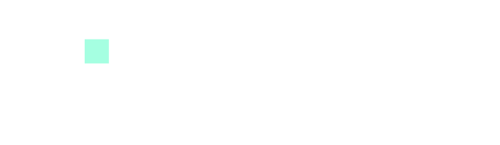

<div align="center">
  
</div>

A personal project template for AI-guided development using OpenCode, OpenSpec, and a disciplined folder ownership model.

## What is this?

This repository is a **template** — not a library or framework. Clone it, rename the remote, and initialize a new derived project with a single command.

It enforces:
- **Consistent project structure** via the `$personal-project-structure` skill
- **AI-readable project context** through `AGENTS.md`
- **Change-driven development** with OpenSpec
- **Authoritative contracts** for APIs, events, and payloads

## Quick Start

```bash
# 1. Clone and move into the directory
git clone https://github.com/your-org/your-new-project.git
cd your-new-project

# 2. Update the remote so you don't push back to the template
git remote set-url origin https://github.com/your-org/your-new-project.git

# 3. Create base folders and initialize OpenSpec
bash scripts/init-project.sh

# 4. Launch opencode and run the interactive wizard
opencode
/template-init
```

The wizard will interview you about your project identity, tech stack, development commands, and conventions — then fill `AGENTS.md` and generate `README.md` from `README.template.md`.

## What's included?

| Component | Purpose |
|---|---|
| `AGENTS.md` | Project-specific instructions, decisions, and conventions for AI agents |
| `README.template.md` | Template for the derived project's README |
| `.env.example` | Sanitized environment variable template |
| `scripts/init-project.sh` | Creates the full folder structure and runs `openspec init` |
| `.opencode/commands/template-init.md` | OpenCode command that interactively contextualizes the template |
| `.codex/skills/personal-project-structure/` | Skill defining folder ownership rules |

## Folder Ownership (after initialization)

| Directory | Responsibility |
|---|---|
| `openspec/` | Planning, requirements, change proposals, and specs |
| `docs/dev/` | Developer setup, debugging, conventions, onboarding |
| `docs/external/` | Third-party API, SDK, and platform research |
| `docs/assets/` | README banners, logos, diagrams, documentation visuals |
| `contracts/` | API contracts, event definitions, schemas, canonical examples |
| `src/` | Application source code |
| `tests/` | Automated tests and test-only fixtures |
| `scripts/` | Repeatable developer, CI, and deployment commands |
| `infra/` | Docker, Terraform, Kubernetes, and infrastructure definitions |
| `data/` | Reusable samples, seeds, and local-development data |
| `tmp/` | Ignored, disposable local working artifacts |

## License

MIT — use it, fork it, adapt it.
